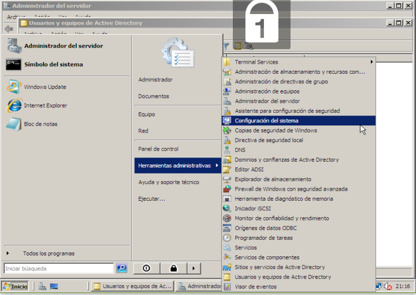
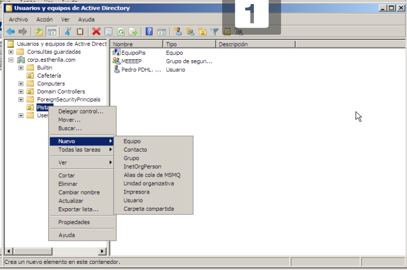
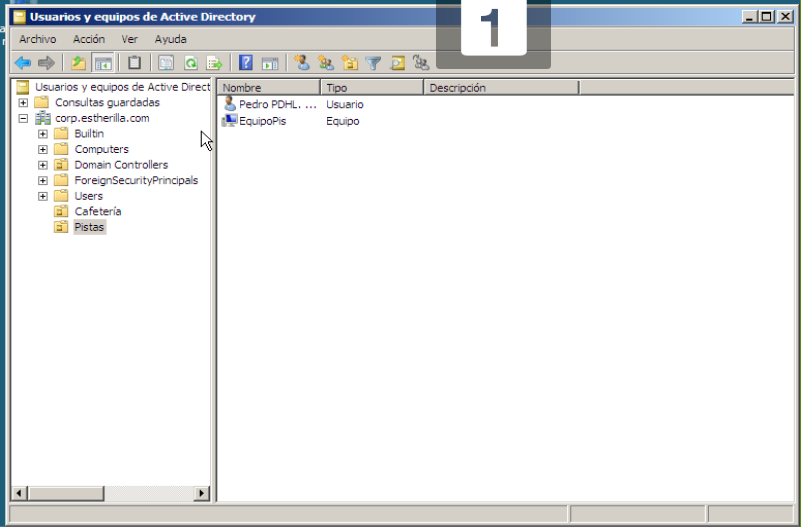
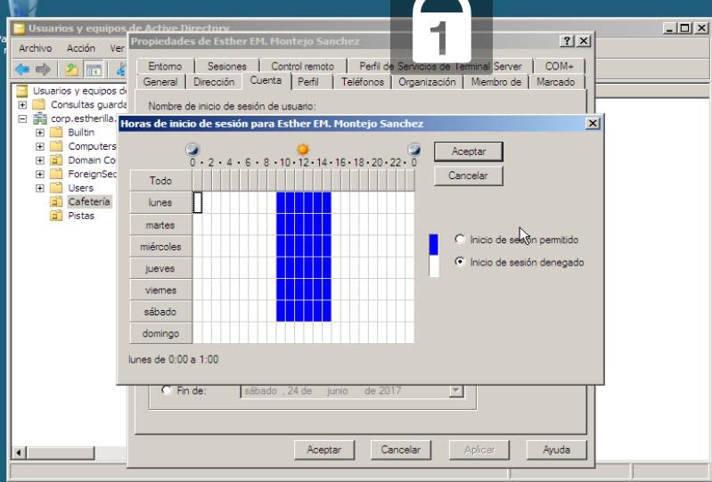
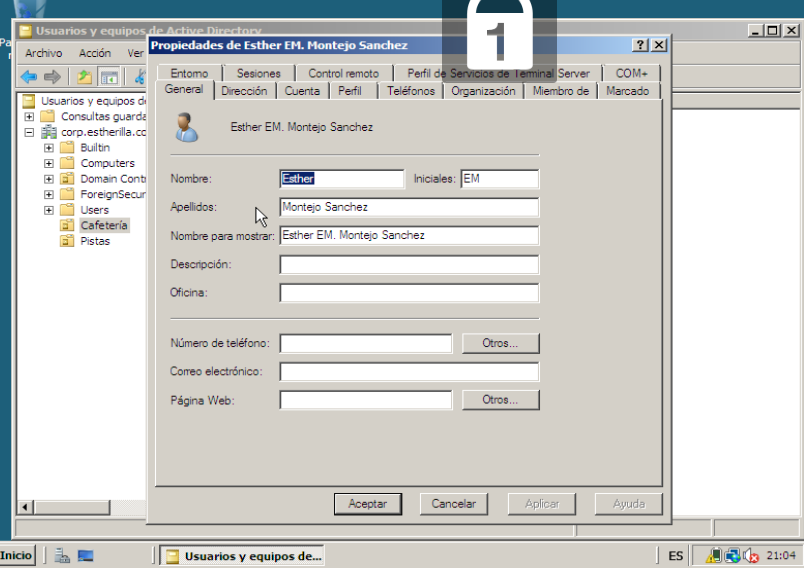
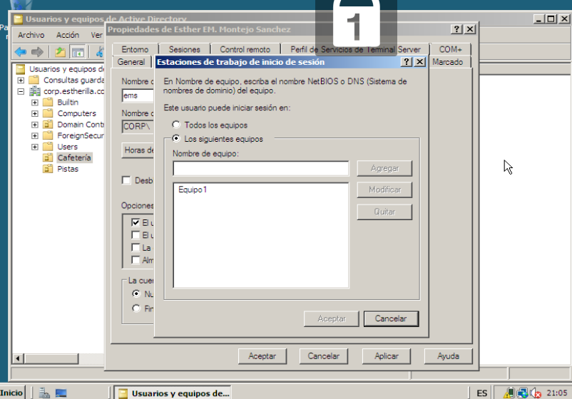
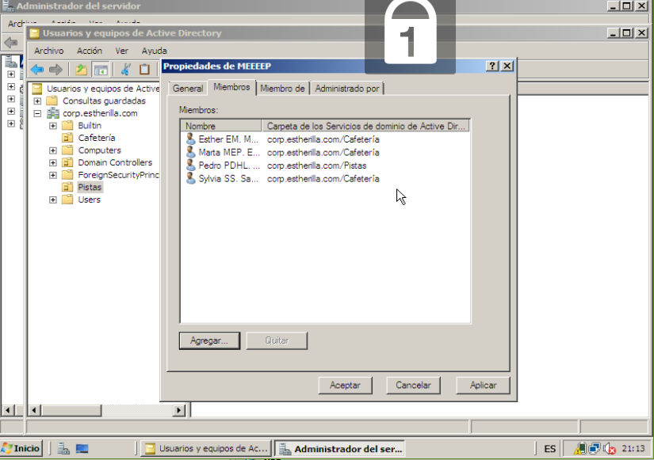

# Windows-Server
Vamos a configurar una empresa en Windows Server con dos unidades organizativas y 4 usuarios repartidos entre ellas, cada uno con un equipo y un grupo que los reune a todos

Para ello instalamos dcpromo en nuestra maquina virtual.

Seguimos estos pasos:

Primero abrimos:

Después añadimos:

Iremos añadiendo tantos equipos y usuarios como queramos.

En cada usuario configuramos las horas que trabaja y el equipo que usa

Añadiremos un grupo y agregamos los usuarios al grupo

Al salir del programa se guarda automáticamente

